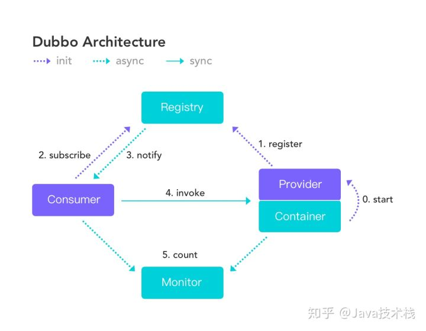

#### dubbo是什么

基于 Java 的高性能 RPC 分布式服务框架。

#### 为什么用

内部使用了 Netty、Zookeeper，保证了高性能高可用性。

可以将核心业务抽取出来，作为独立的服务，逐渐形成稳定的服务中心，提高复用。

分布式可以提高并发量。

#### 流程图

#### 核心配置

dubbo:service | 服务配置 

dubbo:reference | 引用配置 

dubbo:protocol | 协议配置 

dubbo:application | 应用配置

dubbo:module | 模块配置

dubbo:registry | 注册中心配置

dubbo:monitor | 监控中心配置

dubbo:provider | 提供方配置 

dubbo:consumer | 消费方配置 

dubbo:method | 方法配置 

dubbo:argument | 参数配置

#### 集群容错方案

读操作建议使用 Failover 失败自动切换，写操作建议使用 Failfast 快速失败

Failover Cluster | 失败自动切换，自动重试其它服务器（默认）

Failfast Cluster | 快速失败，立即报错，只发起一次调用

Failsafe Cluster | 失败安全，出现异常时，直接忽略

Failback Cluster | 失败自动恢复，记录失败请求，定时重发

Forking Cluster | 并行调用多个服务器，只要一个成功即返回

Broadcast Cluster | 广播逐个调用所有提供者，任意一个报错则报错

#### 负载均衡策略

Random LoadBalance | 随机，按权重设置随机概率（默认）

RoundRobin LoadBalance | 轮询，按公约后的权重设置轮询比率

LeastActive LoadBalance | 最少活跃调用数，相同活跃数的随机

ConsistentHash LoadBalance | 一致性 Hash，相同参数的请求总是发到同一提供者

#### 服务有多个实现

当一个接口有多种实现时，可以用 group 属性来分组，服务提供方和消费方都指定同一个 group 即可。如果想测试指定的某一个服务，用 talnet连接之后操作即可。

#### 服务提供者能实现失效踢出的原理

基于 Zookeeper 的临时节点原理。

#### 服务暴露的过程

Dubbo 会在 Spring 实例化完 bean 之后，在刷新容器最后一步发布 ContextRefreshEvent 事件的时候，通知实现了 ApplicationListener 的 ServiceBean 类进行回调 onApplicationEvent 事件方法，Dubbo 会在这个方法中调用 ServiceBean 父类 ServiceConfig 的 export 方法，而该方法真正实现了服务的发布。

#### zoonkeeper是什么

分布式协调框架，可以基于Zookeeper实现集群管理、Master选举、分布式锁、负载均衡、命名服务等。

#### zoonkeeper提供了什么

##### 文件系统

zookeeper的数据结构为层次化的目录结构，类似于文件系统。它提供一个**多层级的节点命名空间**（节点称为znode），与文件系统不同的是，这些节点包含节点数据和子节点。

##### 通知机制

client端会对某个znode建立一个**watcher**事件，当该znode发生变化时，这些client会收到zk的通知，然后client可以根据znode变化来做出业务上的改变等。

#### zoonkeeper做了什么

##### 1、命名服务

命名服务是指通过指定的名字来获取资源或者服务的地址，利用zk创建一个全局的路径，即是**唯一**的路径，这个路径就可以作为一个名字，指向集群中的集群，提供的服务的地址，或者一个远程的对象等等。

##### 2、配置管理（注册中心）

程序分布式的部署在不同的机器上，将程序的配置信息放在zk的**znode**下，当有配置发生改变时，也就是znode发生变化时，可以通过改变zk中某个目录节点的内容，利用**watcher**通知给各个客户端，从而更改配置。

##### 3、集群管理

所谓集群管理无在乎两点：**是否有机器退出和加入**、**选举master**。

1. 选举线程由当前Server发起选举的线程担任，其主要功能是对投票结果进行统计，并选出推荐的Server；
2. 选举线程首先向所有Server发起一次询问(包括自己)；
3. 选举线程收到回复后，验证是否是自己发起的询问(验证zxid是否一致)，然后获取对方的id(myid)，并存储到当前询问对象列表中，最后获取对方提议的leader相关信息(id,zxid)，并将这些信息存储到当次选举的投票记录表中；
4. 收到所有Server回复以后，就计算出zxid最大的那个Server，并将这个Server相关信息设置成下一次要投票的Server；
5. 线程将当前zxid最大的Server设置为当前Server要推荐的Leader，如果此时获胜的Server获得n/2 + 1的Server票数，设置当前推荐的leader为获胜的Server，将根据获胜的Server相关信息设置自己的状态，否则，继续这个过程，直到leader被选举出来。

总结一下：选举阶段，集群处于Looking状态，它们各自向其他节点发起投票，第一次投票各个节点都会投给自己（节点id和最新事务Id ZXID），各节点根据接收的投票请求比较，优先比较事务ID取最新的事务id，若事务id相同，比较节点id，取节点id更大的投票出去，当一个节点收到了半数以上的投票成为leader。

选完Leader以后，zk就进入状态同步过程。

1. Leader等待server连接；
2. Follower连接leader，将最大的zxid发送给leader；
3. Leader根据follower的zxid确定同步点；
4. 完成同步后通知follower 已经成为uptodate状态；
5. Follower收到uptodate消息后，又可以重新接受client的请求进行服务了。

##### 4、分布式锁

有了zookeeper的一致性文件系统，锁的问题变得容易。锁服务可以分为两类，一个是**保持独占**，另一个是**控制时序**。
对于第一类，我们将zookeeper上的一个**znode看作是一把锁**，通过createznode的方式来实现。所有客户端都去创建 /distribute_lock 节点，最终成功创建的那个客户端也即拥有了这把锁。用完删除掉自己创建的distribute_lock 节点就释放出锁。
对于第二类， /distribute_lock 已经预先存在，所有客户端在它下面创建临时顺序编号目录节点，和选master一样，**编号最小的获得锁**，用完删除，依次方便。

##### 5、负载均衡

zk中通过创建znode维护全部处于正常的服务节点列表，负载均衡器通过watch机制监听各服务节点的变化，检测到某节点宕掉后，删除对应的znode,负载均衡器就可以得到通知

