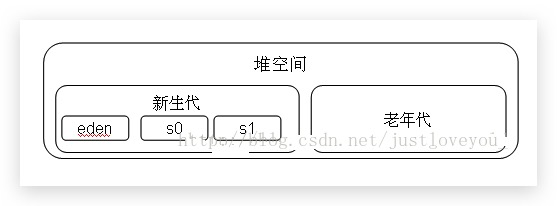

#### JVM 运行时数据区

##### 线程私有的数据区

###### 1.程序计数器

如果线程正在执行的是一个 Java 方法，计数器记录的是正在执行的字节码指令的地址；如果正在执行的是 Native 方法，则计数器的值为空。

###### 2.虚拟机栈

每个方法在执行的时候都会创建一个栈帧，用于存储局部变量表、操作数栈、动态链接、方法出口等信息，每个方法调用直至完成的过程对应一个栈帧在虚拟机栈入栈到出栈的过程。

**一个线程拥有一个自己的栈，这个栈的大小决定了方法调用的可达深度，若线程请求的栈深度大于虚拟机允许的深度，则会抛出 StackOverFlowError。**

**若虚拟机栈在扩展的时候无法申请到足够的内存（比如没有足够的内存为一个新创建的线程分配栈空间时），则会抛出 OutofMenmoryError 异常。**

###### 3.本地方法栈

本地方法栈与 Java 虚拟机栈非常相似，也是线程私有的，区别是虚拟机栈为虚拟机执行 Java 方法服务，而本地方法栈为虚拟机执行 Native 方法服务。

##### 线程共享的数据区

###### 1.Java 堆

Java 堆的唯一目的就是存放对象实例，几乎所有的对象实例（和数组）都在这里分配内存。

###### 2.方法区

其用于存储已被虚拟机加载的类信息、常量、静态变量、即时编译器编译后的代码等数据。

jdk1.7时，字符串常量池转移到了堆，运行时常量池仍然在方法区了；jdk1.8时，方法区变为元空间，元空间与堆不同逻辑空间。

###### 2.1运行时常量池

是方法区的一部分，class文件除了有类的信息外，还有一项信息是常量池，用于存放编译期生成的各种字面量和符号引用，这部分内容将在类加载后进入方法区的运行时常量池。运行时常量池相对于Class文件常量池的一个重要特征是具备**动态性**，意思就是并非预置入class文件中常量池的内容才能进入运行时常量池，运行期间也可能将新的常量放入池中，比如String的intern方法，1.6保存在常量池，1.7堆中引用存到常量池。

##### 直接内存

直接内存并不是虚拟机运行时数据区的一部分，在jdk1.4中新加入了NIO类，引入了一种基于通道（Channel）与缓冲区（Buffer）的I/O方式，它可以使用Native函数库直接分配堆外内存，然后通过一个存储在Java堆中的DirectByteBuffer对象作为这块内存的引用进行操作，避免了在Java堆和Native堆中来回复制数据。

##### OOM

这里对oom进行一段总结，除了程序计数器之外，其它都会发生oom，而对于堆，要确认是内存泄漏还是内存溢出，可以设置xms、xmx大小来解决；对于方法区以及运行时常量池，可以使用cglib字节码和intern方法测试出；对于虚拟机栈，一般是stackoverflow异常，减少栈容量（意味着容纳更多线程），或许会出现oom。

#### JVM中的对象实例化

##### 1.相应类加载检查过程

Java 程序中的 new 操作会转换为 Class 文件中方法的 new 字节指令，JVM 遇到 new 指令时，先检查指令参数能否在常量池中定位到一个类的符号引用。如果定位到，就先检查这个符号引用代表的类是否被加载、连接、初始化过；如果没有则先进行相应的类加载过程。

##### 2.为对象分配内存

检查过程后，JVM 会为该对象分配内存（其实多少内存在类加载完成后就已经知道了），相当于在 Java 堆上将一块确定的内存分出来。

如果 Java 堆连续，使用**指针碰撞**：一边已存储，一边是空闲，往空闲靠

如果不连续，则使用**空闲列表**：在存储了空间信息的列表上找到足够的空间

是否连续决定于 JVM 是否带有压缩功能。比如采用标记-清除算法的就会产生内存碎片。

针对线程安全，在并发条件下可以引出cas操作和threadlocal两个知识点。

##### 3.分配后内存初始化为零值，并对对象进行必要的设置

分配完内存后，JVM 就会给分配到的内存空间都初始化为零值（不包括对象头），因为对象头包含了一些基本信息，虚拟机要进行必要的基本设置，比如该对象是哪个类的实例、对象的哈希码、对象的GC分代年龄等，是否要启用偏向锁。

##### 4.执行对象实例方法

对于 JVM 来说，对象已经创建完成了，而对于 coder 来说才刚刚开始，首先程序按照程序员的定义来初始化对象，比如 age = 10；然后执行构造方法。

#### JVM 垃圾回收机制

##### 如何判断哪些内存需要回收

###### 1.引用计数法

被引用时加1，当一个实例被回收，引用计数减1。任何引用计数为0的对象实例可以被当做垃圾收集。

**很难解决对象之间互相循环引用。**

###### 2.可达性分析算法

将**虚拟机栈中引用的对象、本地方法中Native方法引用的对象、方法区中静态属性和常量引用的对象**作为GC Root 的对象，向下搜索判断是否可达。

在这里强引用、软引用、弱引用、虚引用的概念就不再展开。

#### 何时回收

##### 1.新生代

一般新生成的对象首先都是放在新生代。新生代内存按照8：1：1的比例分为一个eden区和两个survivor(survivor0，survivor1)区，大部分在Eden区生成。回收时，现将eden区存活对象复制到survivor0区，然后清空eden区，当suivivor0区满时，将eden区和survivor0区存活对象复制到survivor1区，清空eden区和survivor0区。当Eden区没有足够空间进行分配时，虚拟机将发起一次MinorGC。

发生**MinorGC**，频率高。

##### 2.老年代

老年代存放的都是一些生命周期较长的对象，在新生代中经历了N次垃圾回收后仍然存活的对象就会被放到老年代中。大对象直接进入老年代。长期存活的对象将进入老年代。

发生**FullGC**，频率低。

##### 3.永久代

永久代主要用于存放静态文件。

- **Minor GC：**对新生代进行回收，不会影响到年老代。因为新生代的 Java 对象大多死亡频繁，所以 Minor GC 非常频繁，一般在这里使用速度快、效率高的算法，使垃圾回收能尽快完成。
- **Full GC：**也叫 Major GC，对整个堆进行回收，包括新生代和老年代。由于Full GC需要对整个堆进行回收，所以比Minor GC要慢，因此应该尽可能减少Full GC的次数，导致Full GC的原因包括：老年代被写满、永久代（Perm）被写满和System.gc()被显式调用等。

#### 回收算法

##### 1.标记清除算法

易产生内存碎片，不易于下次分配。

##### 2.复制算法

适合存活率低的情况

##### 3.标记整理算法

适合存活率高的情况        

#### JVM调优

jps查看虚拟机进程、jstat查看虚拟机各方面的运行数据、jmap生成堆转储快照、jstack虚拟机的线程快照。

举个例子，项目里要用到大量的NIO操作，xms和xmx设置的一样，用来防止变化，设置大了，直接内存就小了，抛出异常。

#### 小结

虽然有回收机制，但也会出现内存泄露的问题，例如Hashmap、Vector的静态使用，数据库连接未关闭······

[回收机制大纲](https://juejin.im/post/5b85ea54e51d4538dd08f601)

[G2和cms收集器浅谈](https://blog.csdn.net/huanbia/article/details/75581423)

用一句话总结就是，都是缩短停顿时间，cms是牺牲吞吐量为条件，cpu敏感、无法处理浮动垃圾、标记清除产生内存碎片；G2并行于并发、分代收集、空间整合、可预测的停顿。

#### JVM类加载周期

[类加载博文](https://blog.csdn.net/boyupeng/article/details/47951037)

[类加载器博文](http://www.cnblogs.com/xing901022/p/4574961.html)

在编写完一个源文件后，经过编译会生成一个后缀名为 class 的字节码文件，类加载周期其实是针对该字节码文件的从加载到卸载的全过程。

这里不得不提一下另一个概念—**类加载**，它包括加载、连接和初始化。

##### 加载

1.通过“类全名”来获取定义此类的二进制字节流

2.将字节流所代表的静态存储结构转换为方法区的运行时数据结构

3.在java堆中生成一个代表这个类的 java.lang.Class 对象，作为方法区这些数据的访问入口

##### 连接

**1.验证：**当一个类被加载之后，必须要验证一下这个类是否合法

**2.准备：**为类的静态变量分配内存并设为jvm默认的初值，而不是我们在程序中设定的初值

**3.解析：**把常量池中的符号引用转换为直接引用

##### 初始化

在直接引用的条件下必须触发初始化，除直接引用外都是被动引用。

###### 直接引用：

- 通过new关键字实例化对象、读取或设置类的静态变量、调用类的静态方法。
- 通过反射方式执行以上三种行为。
- 初始化子类的时候，会触发父类的初始化。
- 作为程序入口直接运行时（也就是直接调用main方法）。

###### 被动引用：

- 引用父类的静态字段，只会引起父类的初始化，而不会引起子类的初始化。
- 定义类数组，不会引起类的初始化。
- 引用类的常量（final），不会引起类的初始化。

#### 类与类加载器

##### 类加载器

虚拟机团队把类加载阶段中的"通过一个类的全限定名来获取描述此类的二进制字节流"这个动作放到 Java 虚拟机外部去实现，实现这个动作的代码模块称为“类加载器”。

从虚拟机的角度来讲，只存在两种不同的类加载器：一种是启动类加载器，这个类加载器使用C++实现，是虚拟机自身的一部分；另一种是其它的类加载器，这些类加载器都由 Java 实现，独立于虚拟机外部，都继承自抽象类java.lang.ClassLoader。

从高等级到低等级，类加载器大体可分为启动类加载器、扩展类加载器、应用类加载器、自定义类加载器。

##### 双亲委派模型

双亲委派模型要求除了顶层的启动类加载器外，其余的类加载器都应当有自己的父类加载器，在这里类加载器之间都使用组合关系来复用父类加载器的代码。

双亲委派模型的工作过程是：如果一个类加载器收到了类加载的请求，它首先不会自己去尝试加载这个类，而是把这个请求委派给父类加载器去完成，父类加载失败，则抛出classnotfound异常，再调用自己的findclass方法。这样有一个好处是 Java 类随着它的类加载器一起具备了一种带有优先级的层次关系，因此 Object 类在程序的各种类加载器环境中都是同一个类。如果尝试去编写一个与rt.jar类库中已有类重名的 Java 类，将会发现可以正常编译，但是永远无法被加载运行。

