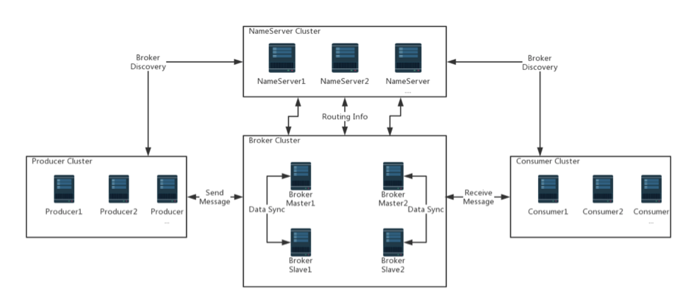

#### MQ理解

MQ是消费-生产者模型的一个典型的代表，一端往消息队列中不断写入消息，而另一端则可以读取队列中的消息。自己用ReentrantLock和Condition写个生产者-消费者队列就会很明白。

##### RabbitMQ

发消息者、交换机、队列、收消息者

Direct, topic, Headers（不管） and Fanout

无非就是交换机和队列绑定，绑定的时候根据情况是否添加topic路由键，接收方监听队列。

##### RocketMQ

RocketMQ分的比较细，消息生产者、生产者组、消息消费者、消费者组、topic逻辑分类、tag标签、Broker、Name Server为生产者和消费者提供路由信息。（rabbitmq的好理解，发时带topic，交换机根据topic给不同的队列）

从 Broker 开始，Broker Master1 和 Broker Slave1 是主从结构，它们之间会进行数据同步，即 Date Sync。同时每个 Broker 与
 NameServer 集群中的所有节点建立长连接，定时注册 Topic 信息到所有 NameServer 中。

Producer 与 NameServer 集群中的其中一个节点（随机选择）建立长连接，定期从 NameServer 获取 Topic 路由信息，并向提供 Topic 服务的 Broker Master 建立长连接，且定时向 Broker 发送心跳。Producer 只能将消息发送到 Broker master，但是 Consumer 则不一样，它同时和提供 Topic 服务的 Master 和 Slave建立长连接，既可以从 Broker Master 订阅消息，也可以从 Broker Slave 订阅消息。

解耦，生产者不用关心是谁来消费，消费者不用关心谁在生产消息；异步、削峰，异步下单这个例子。

#### RocketMQ是怎么保证系统高可用的

多Master部署，防止单点故障；主从结构，防止消息丢失。

#### RocketMQ是怎么保证系统可靠性

为了降低消息丢失的概率，MQ需要进行超时和重传。

sender传给mq server，mq收到发送ACK给sender，sender接受到表示成功。如果mq发送ack失败，sender 内的 timer 会重发消息，直到收到 ACK消息，如果重试N次后还未收到，则回调发送失败。需要注意的是，这个过程中 mq server 可能会收到同一条消息的多次重发。所以对每条消息，MQ系统内部必须生成一个inner-msg-id，作为去重和幂等的依据，这个内部消息ID的特性是：

- 全局唯一
- MQ生成，具备业务无关性，对消息发送方和消息接收方屏蔽

mq server和receiver之间也类似，需要强调的是，receiver 回ACK给 mq server，是消息消费业务方的主动调用行为，不能由 sender 自动发起，因为MQ系统不知道消费方什么时候真正消费成功。为了保证业务幂等性，业务消息体中，必须有一个biz-id，作为去重和幂等的依据，这个业务ID的特性是：

- 对于同一个业务场景，全局唯一
- 由业务消息发送方生成，业务相关，对MQ透明
- 由业务消息消费方负责判重，以保证幂等

#### 如何实现分布式事务

1. 在消息队列上开启一个事务主题。
2. 事务中第一个执行的服务发送一条“半消息”（半消息和普通消息的唯一区别是，在事务提交之前，对于消费者来说，这个消息是不可见的）给消息队列。
3. 半消息发送成功后，发送半消息的服务就会开始执行本地事务，根据本地事务执行结果来决定事务消息提交或者回滚，RocketMQ提供事务反查来解决异常情况，如果RocketMQ没有收到提交或者回滚的请求，Broker会定时到生产者上去反查本地事务的状态，然后根据生产者本地事务的状态来处理这个“半消息”是提交还是回滚。值得注意的是我们需要根据自己的业逻辑来实现反查逻辑接口，然后根据返回值Broker自己做提交或者回滚，而且这个反查接口已经做到了无状态的，请求到任意一个生产者节点都会返回正确的数据。
4. 本地事务成功后会让这个“半消息”变成正常消息，供分布式事务后面的步骤执行自己的本地事务。（这里的事务消息，producer不会因为consumer消费失败而做回滚，采用事务消息的应用，其所追求的是高可用和最终一致性，消息消费失败的话，MQ自己会负责重推消息，直到消费成功。当然如果你可以根据自己业务来反向操作）。