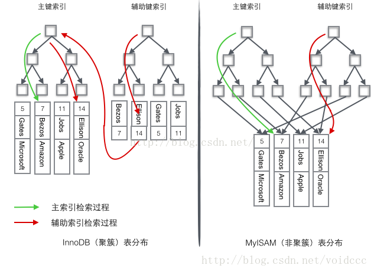

#### innodb的三大特性

##### 插入缓冲

针对非聚簇索引，非聚集索引并非按顺序插入，因此在插入非聚集索引叶节点时，为随机插入，性能不高。

1. 如果索引页在缓冲池中，则直接插入
2. 如果不在，则先放入一个插入缓冲区中，返回插入成功的结果。 
3. master thread会定时讲插入缓冲区中的数据插入数据库

此举将多个插入合并到一个IO操作中，从而提高了性能

##### 两次写

先了解部分写失效，当数据库正在从内存向磁盘写一个数据页时，数据库宕机，从而导致这个页只写了部分数据，就是部分写失效。

部分写失效会导致数据丢失。是无法通过重做日志恢复的，因为重做日志记录的是对页的物理修改，如果页本身已经损坏，重做日志也无能为力。

1. 先将数据写入缓冲区
2. 分两次将缓冲区的数据写入磁盘共享表空间，每次写入1MB（连续的）
3. 将缓冲区的数据写入数据文件（离散的）
   假如宕机
4. 将共享表空间的的页覆盖原有数据页
5. 再应用重做日志

##### 自适应哈希

InnoDB存储引擎会监控对表上各索引页的查询。如果观察到建立哈希索引可以带来速度提升，则建立哈希索引。
InnoDB存储引擎会自动根据访问的频率和模式来自动地为某些热点页建立哈希索引。

#### 联合索引

根据最左前缀原则，例如(a,b,c)就匹配 a,(a,b),(a,b,c)，所以把经常查询的放左边，建立多个单索引占空间不如联合索引。建立联合索引可以实现索引覆盖，即从非主键索引中就能查到的记录，而不需要查询主键索引中的记录，避免了回表的产生。

#### 聚簇索引和非聚簇索引

主键是**唯一标识符**，聚簇索引是一种**数据结构**，即存储数据的结构和索引顺序一样，加快查询速度。一般情况下主键默认会创建一个聚簇索引，一张表只允许有一个聚簇索引；而除了聚簇索引以外的唯一索引、普通索引等都是非聚簇索引，非聚簇索引一般来说也可以叫做辅助索引和二级索引。

> 简单地解释，聚簇索引的叶子节点就是数据节点，而非聚簇索引的叶子节点仍然是索引节点，只不过有指向对应数据块的指针。

MYSQL 中 MYISAM 和 INNODB 两种引擎对主键的支持不同，MYISAM 可以没有主键，但INNODB 如果没有设定主键或者非空唯一索引，**就会自动生成一个6字节的主键**。因此，MYSQL中不同的数据存储引擎对聚簇索引的支持不同就很好解释了，下面，我们可以看一下索引结构。

由图可以看出 MYISAM 是按列值与行号来组织索引的，它的叶子节点中保存的实际上是指向存放数据的物理块的指针，主键索引仅仅只是一个叫做PRIMARY的唯一、非空的索引，而**不是聚簇索引**。MYISAM的主键索引和二级索引没有任何区别。从MYISAM存储的物理文件我们能看出，MYISAM引擎的索引文件（.MYI）和数据文件(.MYD)是相互独立的。

而 INNODB 的主键索引（**是聚簇索引**）的每个叶子节点包含主键值、事务ID、回滚指针(rollback pointer用于事务和MVCC）和余下的列，即整个数据表。INNODB 的二级索引（非聚簇索引）的每个叶子节点包含不像传统非聚簇索引一样的指针，而是主键，减小了移动数据或者数据页面分裂时维护二级索引的开销，因为InnoDB不需要更新索引的行指针。

####  B树和B+树

##### B、B+树的性质（自己理解）

1. 根节点至少有两个子节点；
2. 每个节点最多有m-1个key值，升序排列，value也按照键值排列（B+ 树可能最多有m个，定义不同）
3. 除根节点外，其他节点至少有m/2个节点。

##### B树和B+树的区别

简要解释:
第一点，B+树中，节点的每一个关键字代表一个子树的最大值，因此**子结点数目等于关键字数目**；第二点，叶子节点包含了全部的数据，并按照顺序排列，B+树使用链表将他们连起来，这样在查询时效率更快。

1.**层级更低(更加矮胖)，IO次数更少**。由于 B+ 树的中间节点不含有实际数据，只有子树的最大数据和子树指针，因此磁盘页中可以容纳更多节点元素，也就是说同样数据情况下，B+ 树会 B 树更加“矮胖”，因此查询效率更快。

2.**每次都需要查询到叶子节点，查询性能稳定**。B树这时就能体现出优势，由于出现频率较高的树，在B树中往往在上层(非叶子结点)，查找到该结点就会成功并结束查询，相对较快。而B+树由于非叶子结点关键字只是代表索引，因此在B+树中，无论查找成功与否，都是走了一条从根到叶子节点的路径。

3.**B+树范围查询更加方便**。 需要查询某个范围内的数据时，由于 B+ 树的叶子节点是一个有序链表，只需在**叶子节点上遍历**即可，不用像 B 树那样挨个**中序遍历**比较大小。

#### 事务的隔离级别

可以读未提交的。

读的时候可以写。

写的时候可以写。

#### 锁

MyISAM采用表级锁，InnoDB支持行级锁和表级锁。都分为共享锁和独占锁。乐观锁悲观锁概念。

#### 优化

对sql语句的优化，比如实现limit分页、使用索引、实现索引覆盖等

数据库结构优化，比如一个表分成多个表

主从分离、对重量级、更新少的数据可以考虑使用应用级别的缓存

对于数据多的，先删除索引，再删除数据，再重建索引。

#### 主从复制

- 在主库上把数据更新语句记录到二进制日志
- 从库将主库的日志复制到自己的中继日志
- 从库读取中继日志的事件，将其重放到从库数据中