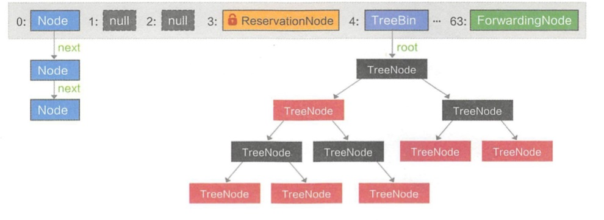

#### ConcurrentHashMap

介绍concurrentHashMap我会主要从两方面开始讲，读写操作和统计size。

首先是JKD1.7之前的`concurrentHashMap`，在这之前最重要的就是`segment`这个概念，其本身就相当于一个HashMap，是一个继承自`ReentrantLock`的内部类，采用**锁分段**技术，对`segment`的写入上锁，`segment`之间互不影响。

1. get和put方法同hashmap类似，不再展开，只是在对segment操作时，需要获取可重入锁
2. 统计size时，前两次先不加锁，乐观思想，统计各个segment的修改次数并累加，与上一次总修改次数作比较，超过两次不一致则全部加锁

再次就是JDK1.8的concurrentHashMap，放弃了segment的设计，取而代之的是Node+CAS+Synchronize来保证并发安全。

1. 取消了分段锁，降低冲突概率
2. 引入红黑树结构，size大于64并且链表长度大于8，treeify为红黑树结构，链表长度小于6变为链表。
3. 统计size更加优化，采用`baseCount`和`CounterCell[]`数组相加的方式， 先用`CAS`更新前者，出现冲突则更新`CounterCell`对应的位置，当后者更新出现错误，则扩容，扩容期间更新`baseCount`，不需要借助锁。

有四个比较重要的内部类：**TreeBin**（引用）、**TreeNode**（存储数据的节点）、**ForwardingNode**（扩容时使用，指向nextTable）、**ReservationNode**（占位节点，插入之前防止slot被其它线程抢占），都继承自Node，Node又继承自Map.Entry。



在链表转化为红黑树过程中，用同步块锁住当前slot的首元素，防止其它线程增删改查，完成后利用cas替换原有链表。

#### CAS（compareAndSet）

```Java
public class Test {
    public AtomicInteger i;
  
    public void add() {
        i.getAndIncrement();
    }
}
```

我们来看`getAndIncrement`的内部：

```Java
public final int getAndIncrement() {
    return unsafe.getAndAddInt(this, valueOffset, 1);
}
```

再深入到`getAndAddInt`():

```java
//unsafe类
private static final Unsafe unsafe = Unsafe.getUnsafe();
private static final long valueOffset;

static {
  try {
    valueOffset = unsafe.objectFieldOffset
      (AtomicInteger.class.getDeclaredField("value"));
  } catch (Exception ex) { throw new Error(ex); }
}

private volatile int value;

public final int getAndAddInt(Object var1, long var2, int var4) {
    int var5;
    do {
        var5 = this.getIntVolatile(var1, var2);
    } while(!this.compareAndSwapInt(var1, var2, var5, var5 + var4));

    return var5;
}
```

总的来说就是在`AtomicInteger`数据定义的部分，我们调用`unsafe`的`objectFieldOffset`从`Atomic`类文件中获取`value`的偏移量，那么`valueOffset`其实就是记录`value`的偏移量的，现在重点来了，`compareAndSwapInt（var1, var2, var5, var5 + var4）`其实换成`compareAndSwapInt（obj, offset, expect, update）`比较清楚，通过`ojb`和`offset`获取`value`如果和`expect`相同，就证明没有其他线程改变过这个变量，那么就更新它为`update`，如果这一步的`CAS`没有成功，那就采用自旋的方式继续进行`CAS`操作，值得一提的是这里`CAS`是借助于一个`CPU`指令完成的，还是原子操作。

###### 缺点

1. **循环时间长开销很大**

   当 `CAS `失败，会一直尝试，所以如果一直不成功会给 `CPU `带来更大的开销。

2. **只能保证一个共享变量的原子操作**
   顾名思义，当对多个共享变量操作时，循环` CAS `就无法保证操作的原子性了，需要用锁来保证。

3. **ABA问题**

   在某个时期内，它的值曾经被改成了B，后来又被改回为A，这就是 `CAS `操作的 ABA 问题。

   解决方法：目前使用atomic包里提供了一个类`AtomicStampedReference`来解决ABA问题，那么`A-B-A` 就会变成`1A-2B-3A`，这个类的`compareAndSet`方法作用是首先检查当前引用是否等于预期引用，其次检查当前标志是否等于预期标志，如果全部相等。

   ```Java
   public static void main(String[] args) {
           String str1 = "aaa";
           String str2 = "bbb";
           AtomicStampedReference<String> reference = new AtomicStampedReference<String>		(str1,1);
           reference.compareAndSet(str1,str2,reference.getStamp(),reference.getStamp()+1);
           System.out.println("reference.getReference() = " + reference.getReference());
   
           boolean b = reference.attemptStamp(str2, reference.getStamp() + 1);
           System.out.println("b: "+b);
           System.out.println("reference.getStamp() = "+reference.getStamp());
   
           boolean c = reference.compareAndSet(str2,"ccc",4, reference.getStamp()+1);
           System.out.println("reference.getReference() = "+reference.getReference());
           System.out.println("c = " + c);
   	}
   //输出：
   //reference.getReference() = bbb
   //b: true
   //reference.getStamp() = 3
   //reference.getReference() = bbb
   //c = false
   //c为什么输出false呢, 因为版本戳不一致啦
   ```

#### ReentrantLock

与 `synchronized` 不再做详细的对比，相比`synchronized`有获取锁与释放锁的可操作性，可中断、超时获取锁`ReentrantLock` 是实现了`Lock`接口的一个类，支持重入性，表示能够对共享资源能够重复加锁，即当前线程获取该锁再次获取不会被阻塞，`synchronized` 提供了便捷性的隐式获取锁释放锁机制（基于JVM机制），具体叫**ACC_SYNCHRONIZED**标记符。

想要支持重入性锁，要解决两个问题：**1.在线程获取锁时，如果已经获取锁的线程是当前线程的话直接在此获取成功；2.由于锁会被获取n次，只有在释放n次后才能算完全获取成功。**很重要的一点是，要理解其中的`Syn`内部类它继承自`AQS`，无论是获取还是释放，都要对`state`进行操作。对于第一个问题，以非公平锁为例，核心方法为`nonfairTryAcquire`：

```Java
final boolean nonfairTryAcquire(int acquires) {
    final Thread current = Thread.currentThread();
    int c = getState();
  	//1、如果未被其它线程拥有，该锁被当前线程获取
    if (c == 0) {
        if (compareAndSetState(0, acquires)) {
            setExclusiveOwnerThread(current);
            return true;
        }
    }
		//2、若被占有，检查占有线程是否是当前线程
    else if (current == getExclusiveOwnerThread()) {
        int nextc = c + acquires;
        if (nextc < 0) // overflow
            throw new Error("Maximum lock count exceeded");
        setState(nextc);
        return true;
    }
    return false;
}
```

释放的时候思路也类似：

```java
protected final boolean tryRelease(int releases) {
  	//1. 同步状态减1
    int c = getState() - releases;
    if (Thread.currentThread() != getExclusiveOwnerThread())
        throw new IllegalMonitorStateException();
    boolean free = false;
    if (c == 0) {
    //2. 只有当同步状态为0时，锁成功被释放，返回true
        free = true;
        setExclusiveOwnerThread(null);
    }
  	// 3. 锁未被完全释放，返回false
    setState(c);
    return free;
}
```

`ReentrantLock`只有2个构造方法，对应生成**非公平锁**和**公平锁**（默认为非公平锁），`FairSync`和`NonfairSync`都是静态内部类：

```Java
public ReentrantLock() {
  sync = new NonfairSync();
 
//传入一个boolean值，true时为公平锁，false时为非公平锁
public ReentrantLock(boolean fair) {
  sync = fair ? new FairSync() : new NonfairSync();
}
```

在上面非公平锁获取时（nonfairTryAcquire方法）只是简单的获取了一下当前状态做了一些逻辑处理，并没有考虑到当前同步队列中线程等待的情况。我们来看看公平锁的处理逻辑是怎样的，核心方法为：

```Java
protected final boolean tryAcquire(int acquires) {
    final Thread current = Thread.currentThread();
    int c = getState();
    if (c == 0) {
      	//hasQueuedPredecessors用来判断当前节点在同步队列中是否有前驱节点的判断，如果有前驱节点说明有线程比当前线程更早的请求资源，根据公平性，当前线程请求资源失败。
        if (!hasQueuedPredecessors() &&
            compareAndSetState(0, acquires)) {
            setExclusiveOwnerThread(current);
            return true;
        }
    }
    /**
    * 省略
    **/
}
```

其中穿插一下`Lock`、`tryLock`、`lockInterruptibly`的区别：

1. lock(), 拿不到lock就不罢休，不然线程就一直block。 比较无赖的做法。
2. tryLock()，马上返回，拿到lock就返回true，不然返回false。 比较潇洒的做法。带时间限制的tryLock()，拿不到lock，就等一段时间，超时返回false。比较聪明的做法。
3. lockInterruptibly()就稍微难理解一些，先说说线程的打扰机制...骗你的我不会说的，线程在请求lock并被堵塞时候，被`interrupt`则会被唤醒处理`InterruptedException`，并且如果已经被`interrupt`，再使用`lockInterruptibly`也会被要求处理`InterruptedException`。

至于 `Condition` ，必须与一个`lock`绑定，通过lock.newCondition()创建，就像 `Monitor` 也要配合 `synchronized` 使用，`Condition` 的await、signal、signalAll 类似于后者的的wait、notify、notifyAll，**代码示例见附件**。

#### Executor

创建对象可以分成很多步，反反复复会花费太多时间，线程池的概念就是为了管理线程，避免创建大量的线程增加开销。

先来对其参数进行解，创建线程就要使用 `ThreadPoolExecutor `或者`ScheduledThreadPoolExecutor `类，前者继承了`AbstractExecutorService`后者实现了`ScheduleExecutorService`，`ThreadPoolExecutor `构造函数如下：

```java
public ThreadPoolExecutor(int corePoolSize,    //核心线程的数量
                          int maximumPoolSize,    //最大线程数量
                          long keepAliveTime,    //超出核心线程数量以外的线程空余存活时间
                          TimeUnit unit,    //存活时间的单位
                          BlockingQueue<Runnable> workQueue,    //保存待执行任务的队列
                          ThreadFactory threadFactory,    //创建新线程使用的工厂
                          RejectedExecutionHandler handler // 当任务无法执行时的处理器
                          ){...}
```

个别名词解释：

**`corePoolSize`：**

​	在线程数少于核心数量时，有新任务进来就新建一个线程，即使有的线程没事干

​	等超出核心数量后，就不会新建线程了，空闲的线程就得去任务队列里取任务执行了

**`keepAliveTime`：**

​	   如果给线程池设置 `allowCoreThreadTimeOut(true)`，则核心线程在空闲时头上也会响起死亡的倒计时。

**`handler`：**有四种饱和策略 

-    `CallerRunsPolicy`：只要线程池没关闭，就直接用调用者所在线程来运行任务
-    `AbortPolicy`：直接抛出 `RejectedExecutionException` 异常(默认方法)
-    `DiscardPolicy`：悄悄把任务放生，不做了
-    `DiscardOldestPolicy`：把队列里待最久的那个任务扔了，然后再调用 `execute` 试试看能行不

我们也可以实现自己的 `RejectedExecutionHandler` 接口自定义策略，比如如记录日志什么的。

**`workQueue`：**实现接口是`BlockingQueue`接口，常用有4种实现。

- `ArrayBlockingQueue`：基于数组，先进先出原则进行排序
- `LinkedBlockingQueue`：基于链表，先进先出原则进行排序
- `SynchronousQueue`：不存储元素的阻塞队列，每个插入操作必须等到另一个线程调用移除操作，否则插入操作一直处于阻塞状态
- `PriorityBlockingQueue`：具有优先级的、无限阻塞队列

然后就是具体执行方法 `ThreadPoolExecutor.execute`：

```java
public void execute(Runnable command) {
    if (command == null)
        throw new NullPointerException();

    int c = ctl.get();
    //1.当前池中线程比核心数少，新建一个线程执行任务
    if (workerCountOf(c) < corePoolSize) {   
        if (addWorker(command, true))
            return;
        c = ctl.get();
    }
    //2.核心池已满，但任务队列未满，添加到队列中
    if (isRunning(c) && workQueue.offer(command)) {   
        int recheck = ctl.get();
        if (! isRunning(recheck) && remove(command))    //如果这时被关闭了，拒绝任务
            reject(command);
        else if (workerCountOf(recheck) == 0)    //如果之前的线程已被销毁完，新建一个线程
            addWorker(null, false);
    }
    //3.核心池已满，队列已满，试着创建一个新线程
    else if (!addWorker(command, false))
        reject(command);    //如果创建新线程失败了，说明线程池被关闭或者线程池完全满了，拒绝任务
}
```

源代码通俗化表示，将线程池比作一个团队，其中核心线程就是核心人员，等待队列是接下来需要完成的任务列表，而总线程数除去核心线程外的则是外包人员，所以步骤归结如下：

1. 判断是否小于最大核心人员，小于则新招一个核心人员（需要获得全局锁）
2. 若大于最大核心人员，需求攒着放入阻塞队列

3. 若阻塞队列满了，则找个外包（需要获得全局锁）
4. 如果满了，则接受不了。

由于1、3需要获得全局锁，所以大部分都集中在2。

对于**线程池类型**主要有四个，`FixedThreadPool` 理解为限制当前线程数量，`SingleThreadExecutor`理解为单线程执行任务，`CachedThreadPool`理解为无限制创建线程，但不代表不可以复用线程，在线程被回收前就可以复用，`ScheduledThreadPoolExecutor`理解为周期执行，两个终止方法为`scheduleAtFixedRate()`和`scheduleWithFixedDelay()`。

###### 任务提交

1. `execute()`：提交不需要返回值的任务

   ```java
   void execute(Runnable command);//参数是runnable
   ```

2. `submit()`：提交需要返回值的任务（Future）

   ```java
   <T> Future<T> submit(Callable<T> task);
   <T> Future<T> submit(Runnable task, T result);
   Future<?> submit(Runnable task);
   //1、3常用，2不常用
   ```

在这边扩展一下`Future`，它也是一个接口

```Java
public interface Future<V> {
    boolean cancel(boolean mayInterruptIfRunning);
    boolean isCancelled();
    boolean isDone();
    V get() throws InterruptedException, ExecutionException;
    V get(long timeout, TimeUnit unit)
        throws InterruptedException, ExecutionException, TimeoutException;
}
//提供了三种功能
//1、判断任务是否完成
//2、能够中断任务
//3、能够获取任务执行结果
```

###### 关闭线程池

1.`shutdown`：结束未执行的线程任务

2.`shutdownNow`：结束未执行的线程任务，通过调用worker线程的`interrupt()`方法尽最大努力(best-effort)去"终止"已经运行的任务。（涉及interrupt知识点）**代码示例见附件**

#### AQS

> 队列同步器AbstractQueuedSynchronizer（以下简称同步器），是用来构建锁或者其他同步组件的基础框架。

总结出以下**比较关键**的信息：

- `AQS`其实就是一个可以给我们实现锁的**框架**
- 内部实现的关键是：**先进先出的队列、state状态**
- 拥有两种线程模式：共享模式、独占模式

##### 同步状态(state)

1. 使用 `volatile` 修饰线程状态的可见性
2. 使用`compareAndSetState`设置当前`state`

##### 先进先出队列（CLH 队列，是一个双向队列）

1. 同步器包含两个节点类型的引用，分别是**头节点**和**尾节点**。
2. 未获取到锁的线程将创建一个节点，在`addWaiter`中通过一个`CAS`方法`compareAndSetTail`设置到末尾。
3. 首节点释放锁时，将会唤醒后继节点，将其设为首节点。

接下来会介绍几个API方法：

`acquire(int arg)`、`acquireInterruptibly(int arg)`、`acquireShared(int arg)`、`acquireSharedInterruptibly(int arg)`、`tryAcquire(int arg)`、`tryRelease(int arg)`、`tryAcquireShared(int arg)`、`tryReleaseShared(int arg)`，好吧，太多了我不想介绍了...但是总结一下，无论是获取和释放共享锁还是独占锁，都是先try，再出列或者入列，或者到CLH同步队列，不断自旋，xxxInterruptibly参考 `ReentrantLock`的`lockInterruptibly`吧，响应中断嘛。

再口头叙述一下获取过程：

**独占锁**，尝试获取同步状态（锁），失败则将当前线程以及等待状态等信息构造成一个节点（Node）到队列尾部，不断**自旋**检测前驱是否为头节点，是的话获取同步状态，获取失败或者前驱不是头结点则进入等待状态；**共享锁**，跟独占锁相比，共享锁的主要特征在于当一个在等待队列中的共享节点成功获取到锁以后（它获取到的是共享锁），既然是共享，那它必须要依次唤醒后面所有可以跟它一起共享当前锁资源的节点，毫无疑问，这些节点必须也是在等待共享锁。**没啥实例，看看读写锁的实例吧**。[康康源码](https://juejin.im/entry/5ae02a7c6fb9a07ac76e7b70)

#### CountDownLatch

> 每当一个线程完成了自己的任务后，调用 countDown() 方法会让计数器的值就会减1。当计数器值到达0时，它表示所有的线程已经完成了任务，那些因为调用 await() 方法而在等待的线程就会被唤醒。

开头就说明一下，`CountDownLatch`通过`AQS`里面的**共享锁**来实现的，`Syn`内部类它继承自`AQS`，中重写了`tryAcquireShared`和`tryReleaseShared`。`ReentrantLock`也是使用`AQS`。

有几个**API**：

```Java
countDownLatch.countDown(); //使CountDownLatch初始值N减1；

countDownLatch.await(); //调用该方法的线程等到构造方法传入的N减到0的时候，才能继续往下执行；

await(long timeout, TimeUnit unit); //与上面的await方法功能一致，只不过这里有了时间限制，调用该方法的线程等到指定的timeout时间后，不管N是否减至为0，都会继续往下执行；

long getCount(); //获取当前CountDownLatch维护的值；
```

直接看源码部分：

```Java
public void countDown() {
  sync.releaseShared(1);//sync不用我说了吧，内部类继承自AQS，有个volatile的state
}
```

`sync.releaseShared(1)`调用时实际还是调用的`tryReleaseShared(int)`。

```Java
//AQS的方法
public final boolean releaseShared(int arg) {
  if (tryReleaseShared(arg)) {
    doReleaseShared();//主要是唤醒下一个节点，至于下一个节点之后共享锁的节点则是在await方法中唤醒（叫setHeadAndPropagate）
    return true;
  }
  return false;
}
//Syn重写AQS的方法
protected boolean tryReleaseShared(int releases) {
  for (;;) {
    int c = getState();   // 获取当前state属性的值
    if (c == 0)   // 如果state为0，则说明当前计数器已经计数完成，直接返回
      return false;
    int nextc = c-1;
    if (compareAndSetState(c, nextc)) // 使用CAS算法对state进行设置
      return nextc == 0;  // 设置成功后返回当前是否为最后一个设置state的线程
  }
}
```

这里`tryReleaseShared(int)`方法即对`state`属性进行减一操作的代码。可以看到，`CAS`会比较`state`是否为c，如果是则将其设置为nextc（自减1），如果`state`不为c，则说明有另外的线程在`getState()`方法和`compareAndSetState()`方法调用之间对`state`进行了设置，当前线程也就没有成功设置`state`属性的值，其会进入下一次循环中，如此往复，直至其成功设置`state`属性的值，即`countDown()`方法调用成功。哎呀，太繁琐了，[康康别人对源码的解析](https://juejin.im/post/5cccee27e51d453a8f348bb2)，**实例见附件**。

#### CyclicBarrier

> 和CountDownLatch类似，不过它是等指定数量的线程都await后，指定数量的线程才开始执行commond，还有它是可重复利用的。

在这里要提一下，`CountDownLatch`主要是重写`tryXX`方法利用`AQS`的`releaseShared`方法，实现`state`和`node`的改变，而`cyclicBarrier`则是利用`Reentrantlock`和`Condition`来实现。

```Java
public class CyclicBarrier {
    private static class Generation {
        boolean broken = false;
    }
    /** The lock for guarding barrier entry */
    private final ReentrantLock lock = new ReentrantLock();
    /** Condition to wait on until tripped */
    private final Condition trip = lock.newCondition();
    /** The number of parties */
    private final int parties;
    /* The command to run when tripped */
    private final Runnable barrierCommand;
    /** The current generation */
    private Generation generation = new Generation();
    ...省略后面代码
}
```

其中`Generation`用来控制屏障的循环使用，如果`broken`为true的话，说明这个屏障已经损坏，当某个线程`await`的时候，直接抛出异常。

```Java
private int dowait(boolean timed, long nanos)
    throws InterruptedException, BrokenBarrierException,
           TimeoutException {
    final ReentrantLock lock = this.lock;
    lock.lock();
    try {
        final Generation g = generation;
        if (g.broken)
            throw new BrokenBarrierException();
        if (Thread.interrupted()) {
            breakBarrier();
            throw new InterruptedException();
        }
        int index = --count;//内部变量count减1
        if (index == 0) {  // tripped
            boolean ranAction = false;
            try {
                final Runnable command = barrierCommand;
                if (command != null)
                    command.run();
                ranAction = true;
                nextGeneration();//实现屏障的循环使用,重新生成Generation对象,恢复count值
                return 0;
            } finally {
                if (!ranAction)
                    breakBarrier();
            }
        }
        // loop until tripped, broken, interrupted, or timed out
        for (;;) {
            try {
                if (!timed)
                    trip.await();//没有到屏障，在锁条件上等待
                else if (nanos > 0L)
                    nanos = trip.awaitNanos(nanos);
            } catch (InterruptedException ie) {
                if (g == generation && ! g.broken) {
                    breakBarrier();
                    throw ie;
                } else {
                    // We're about to finish waiting even if we had not
                    // been interrupted, so this interrupt is deemed to
                    // "belong" to subsequent execution.
                    Thread.currentThread().interrupt();
                }
            }
            if (g.broken)
                throw new BrokenBarrierException();
            if (g != generation)
                return index;
            if (timed && nanos <= 0L) {
                breakBarrier();
                throw new TimeoutException();
            }
        }
    } finally {
        lock.unlock();
    }
}
```

#### ReentrantReadWriteLock

之前先要介绍个重点**锁降级**，其余的请移步[深入简出ReentrantReadWriteLock](https://blog.csdn.net/qq_38293564/article/details/80533821)

先来看看它的重要属性：

```Java
public class ReentrantReadWriteLock
        implements ReadWriteLock, java.io.Serializable {
    private static final long serialVersionUID = -6992448646407690164L;
    /** Inner class providing readlock */
    private final ReentrantReadWriteLock.ReadLock readerLock;
    /** Inner class providing writelock */
    private final ReentrantReadWriteLock.WriteLock writerLock;
    /** Performs all synchronization mechanics */
    final Sync sync;
  
  	public ReentrantReadWriteLock() {
   		this(false);
		}
  	public ReentrantReadWriteLock(boolean fair) {
      sync = fair ? new FairSync() : new NonfairSync();
      readerLock = new ReadLock(this);
      writerLock = new WriteLock(this);
  	}
}
```

`ReentrantReadWriteLock`中包含了下面三个对象：`sync`，读锁`readerLock`和写锁`writerLock`。读锁`ReadLock`和写锁`WriteLock`都实现了`Lock`接口。读锁`ReadLock`和写锁`WriteLock`中也都分别包含了"Sync对象"，它们的`Sync`对象和`ReentrantReadWriteLock`的`Sync`对象 是一样的，就是通过`sync`，读锁和写锁实现了对同一个对象的访问。

看过`ReadWriteLock`接口的都知道，其只有两个方法：`writeLock`和`readLock`，拿写锁的实现为例：

```Java
public static class WriteLock implements Lock, java.io.Serializable {
    private static final long serialVersionUID = -4992448646407690164L;
    private final Sync sync;
  
    protected WriteLock(ReentrantReadWriteLock lock) { sync = lock.sync; }
  
    public void lock() {
        sync.acquire(1);
    }

    public void lockInterruptibly() throws InterruptedException {
        sync.acquireInterruptibly(1);
    }

    public boolean tryLock( ) {
        return sync.tryWriteLock();
    }

    public boolean tryLock(long timeout, TimeUnit unit)
            throws InterruptedException {
        return sync.tryAcquireNanos(1, unit.toNanos(timeout));
    }

    public void unlock() {
        sync.release(1);
    }
		//只有写锁有，读锁直接抛出UnsupportedOperationException异常
    public Condition newCondition() {
        return sync.newCondition();
    }
    ...
}
```

上述对`ReadLock`就不在展示源码，从源码中可以看出，读锁、写锁的操作都是依靠`Sync`类来实现的，我们来看一看`Sync`类的主要属性和方法：

```Java
// 读锁同步状态占用的位数
static final int SHARED_SHIFT   = 16;
// 每次增加读锁同步状态，就相当于增加SHARED_UNIT
static final int SHARED_UNIT    = (1 << SHARED_SHIFT);
// 读锁或写锁的最大请求数量（包含重入）
static final int MAX_COUNT      = (1 << SHARED_SHIFT) - 1;
// 低16位的MASK，用来计算写锁的同步状态
static final int EXCLUSIVE_MASK = (1 << SHARED_SHIFT) - 1;

// 返回共享锁数
static int sharedCount(int c)    { return c >>> SHARED_SHIFT; }
// 返回独占锁数
static int exclusiveCount(int c) { return c & EXCLUSIVE_MASK; }

```

总结一下即读锁和写锁的状态获取和设置如下：读锁状态的获取：

- 读锁状态的获取：S >> 16
- 读锁状态的增加：S + (1 << 16)
- 写锁状态的获取：S & 0x0000FFFF
- 写锁状态的增加：S + 1

这里不得不再提一下，`Sync`都是重写`tryXX`方法的，那些`acquire`之类的只是把线程作为节点添加到末尾，然后

`Sync`里的`lock`方法调用`acquire`。

写锁的`tryAcquire`方法`和ReentrantLock`的`tryAcquire(int)`方法大致一样，只不过在判断重入时增加了一个读锁是否存在的判断。因为要确保写锁的操作对读锁是可见的。

读锁的`tryAcquireShared`方法相对来说比较复杂，因为多个线程可以公用，简单叙述下过程，由于它可以锁降级，他会`exclusiveCount(c)`判断是否需要降级，然后判断是否第一次被线程获取，是否被第一次后去的线程重复获取，都不是则更新`HoldCounter`(包含了线程持有共享锁的数量和线程的id)，最后调用`fullTryAcquireShared(current)`循环重试，然后根据“是否需要阻塞等待”，“读锁状态是否超过限制”等进行处理。

还有就是个**锁降级**，就是写锁降级为读锁，但是需要遵循先获取写锁、获取读锁在释放写锁的次序，还是看官方的 实例代码吧，虽然不知道为什么他获取读锁是什么意思：

```Java
public void processData() {
    readLock.lock();
    if (!update) {
        // 必须先释放读锁
        readLock.unlock();
        // 锁降级从获取到写锁开始
        writeLock.lock();
        
        try {
            if (!update) {
                // 准备数据的流程(略)
                update = true;
            }
            readLock.lock();
        } catch (Exception e) {
            e.printStackTrace();
        } finally {
            writeLock.unlock();
        }
        // 锁降级完成，写锁降级为读锁
    }
    
    try {
        // 使用数据的流程(略)
    } catch (Exception e) {
        e.printStackTrace();
    } finally {
        readLock.unlock();
    }
}
```

在上述代码中，当数据发生变化后，update变量（布尔volatile类型）被设置为false。