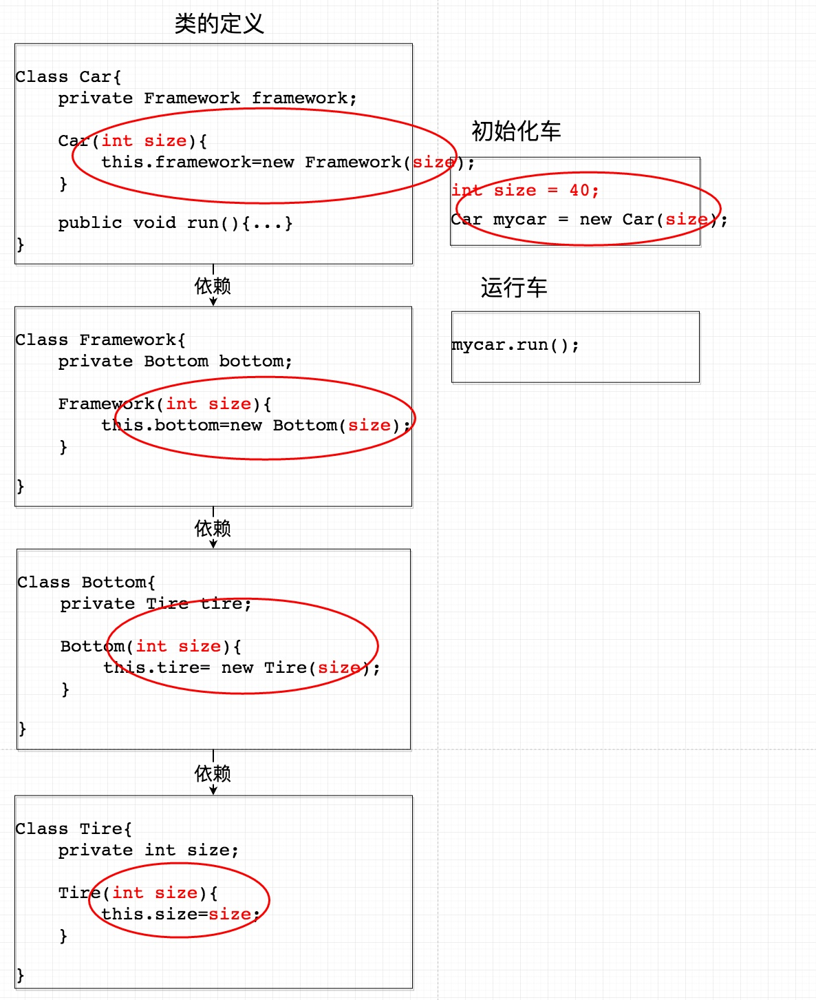
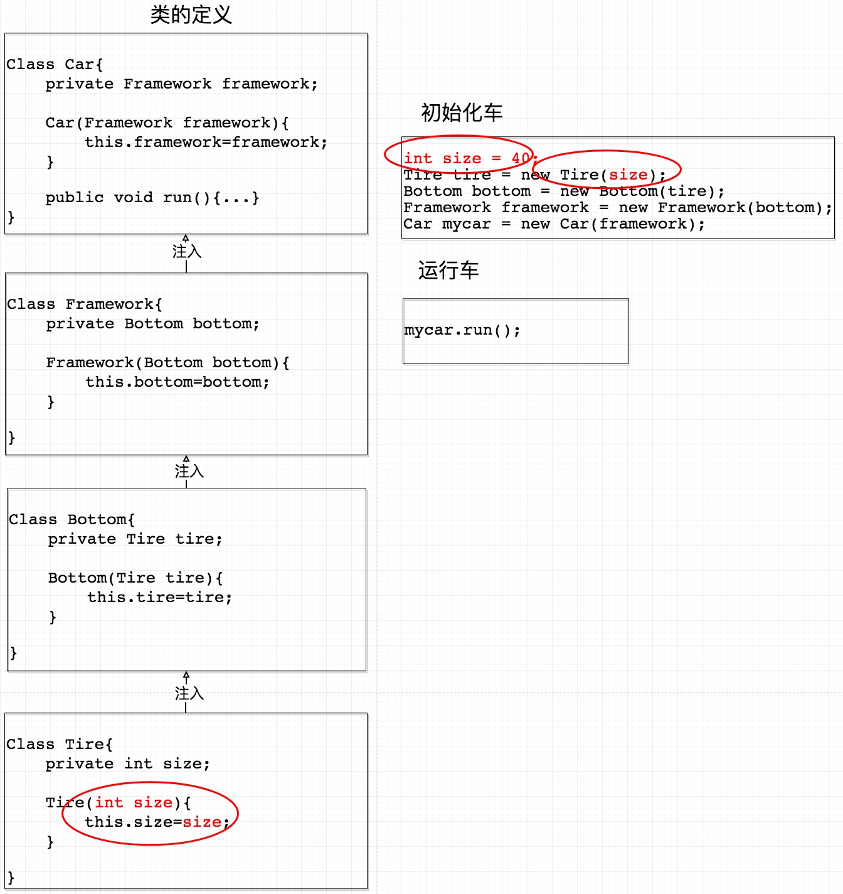
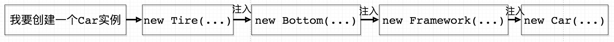

先作为一个spring的笔记 ，之后待整理。

这是我看完spring实战第一部分以及spring相关设计模式时对控制反转（IOC）和依赖注入（DI）的感受。

关键词：注入、ioc容器、解耦 

用一句话解释就是**控制反转** 就是依赖倒置原则的一种代码设计的思路。具体采用的方法就是所谓的**依赖注入**。

由此可见，不断的构造器嵌套，牵一发而动全身，而且大部分公司的类动不动则上百个，一旦修改底部会花费太多的时间。

而通过依赖注入的方式（构造函数注入、Setter传递、接口传递等），只需专注于要修改部分即可，但是正因为采用了依赖注入，在初始化的过程中就不可避免的会写大量的new。

这里IoC容器就解决了这个问题。**这个容器可以自动对你的代码进行初始化，你只需要维护一个Configuration（可以是xml配置可以是 java配置，推荐自动装配）**。这是引入IoC Container的第一个好处。

IoC Container的第二个好处是：**我们在创建实例的时候不需要了解其中的细节。**在上面的例子中，我们自己手动创建一个车instance时候，是从底层往上层new的：

而IoC Container在进行这个工作的时候是反过来的，它先从最上层开始往下找依赖关系，到达最底层之后再往上一步一步new（有点像深度优先遍历）：

Spring容器并不是只有一个，可以分为两种类型：**bean工厂**和**应用上下文**，BeanFactory仅提供了最基本的依赖注入支持，而ApplicationContext基于BeanFactory构建，扩展了BeanFactory，容器启动的时候，不管你用没用到，一次性创建所有 bean 。

bean的生命周期

1、Spring对bean进行实例化;

2、Spring将值和bean的引用注入到bean对应的属性中;

3、如果bean实现了BeanNameAware接口，Spring将bean的ID传递给setBeanName()方法;

4.如果bean实现了BeanFactoryAware接口，Spring将调用setBeanFactory()方法，将BeanFactory容器实例传入;

5.如果bean实现了ApplicationContextAware接口，Spring将调用setApplicationContext ()方法，将bean所在的应用上下文的引用传入进来;

6.如果bean实现了BeanPostProcessor接口，Spring将调用它们的post-ProcessBeforeInitialization()方法;

7.如果bean实现了InitializingBean接口，Spring将调用它们的after-PropertiesSet()方法。类似地，如果bean使用init-method声明了初始化方法，该方法也会被调用;

8.如果bean实现了BeanPostProcessor接口，Spring将调用它们的post-ProcessAfterInitialization()方法;

9.此时，bean已经准备就绪，可以被应用程序使用了，它们将一直驻留在应用上下文中，直到该应用上下文被销毁;

10.如果bean实现了DisposableBean接口，Spring将调用它的destroy()接口方法。同样，如果bean使用destroy-method声明了销毁方法，该方法也会被调用。