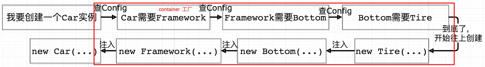
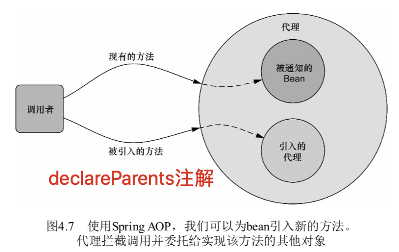
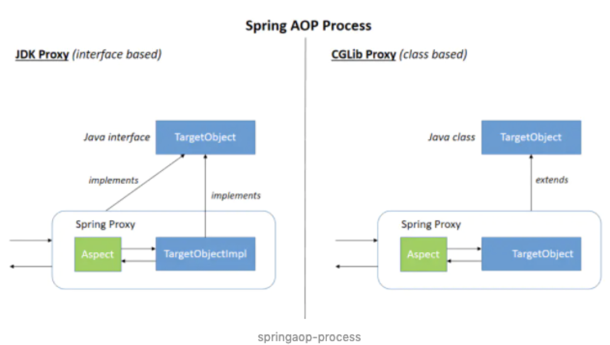
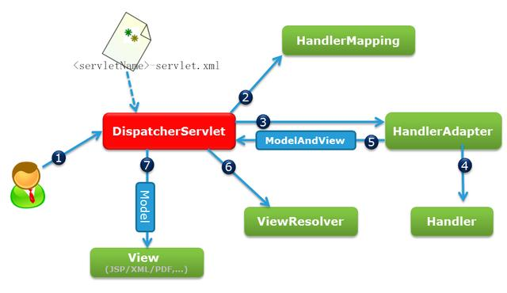
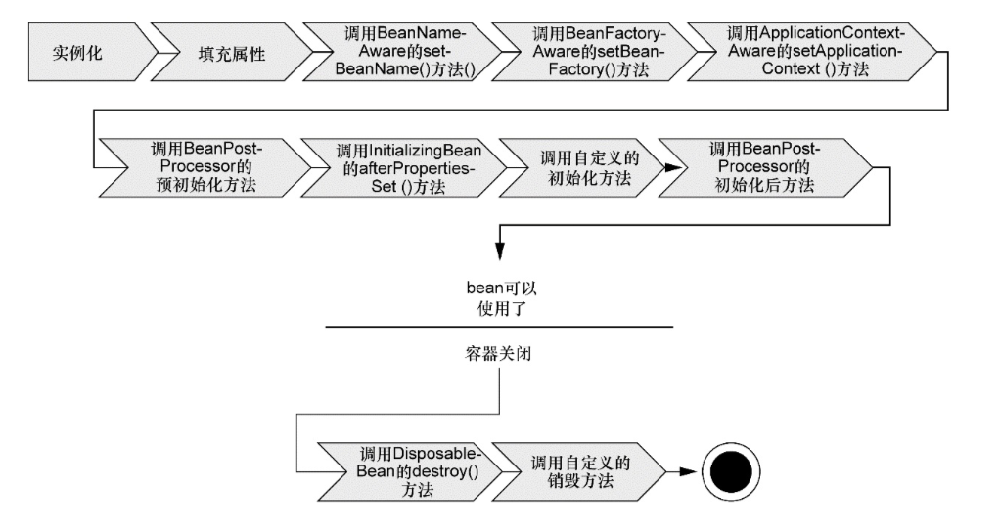

先作为一个spring的笔记 ，之后待整理。

这是我看完spring实战第一部分以及spring相关设计模式时对控制反转（IOC）和依赖注入（DI）的感受。

关键词：注入、ioc容器、解耦 

#### 控制反转（IoC）


用一句话解释就是**控制反转** 是依赖倒置原则的一种代码设计的思路。具体采用的方法就是所谓的**依赖注入**。


由此可见，不断的构造器嵌套，牵一发而动全身，而且大部分公司的类动不动则上百个，一旦修改底部会花费太多的时间。


而通过依赖注入的方式（构造函数注入、Setter传递、接口传递等），只需专注于要修改部分即可，但是正因为采用了依赖注入，在初始化的过程中就不可避免的会写大量的new。

这里IoC容器就解决了这个问题。**这个容器可以自动对你的代码进行初始化，你只需要维护一个Configuration（可以是xml配置可以是 java配置，推荐自动装配）**。这是引入IoC Container的第一个好处。

IoC Container的第二个好处是：**我们在创建实例的时候不需要了解其中的细节。**在上面的例子中，我们自己手动创建一个车instance时候，是从底层往上层new的：


而IoC Container在进行这个工作的时候是反过来的，它先从最上层开始往下找依赖关系，到达最底层之后再往上一步一步new（有点像深度优先遍历和双亲委派模型）：



#### SpringAOP切面编程

在之后就是spring的AOP。系统由许多不同的组件组成，每一个组件各负责一块特定模块，除了实现核心功能外，还要实现额外的职责，像日志、事务管理和安全这些系统服务经常融入到具有核心业务逻辑的组件中去，这些系统服务往往称为横向关注点，因为它会横跨系统的多个组件。

如果将关注点分散到多个组件中去，组件会因为那些与自身核心业务无关的代码而变得混乱，即是封装成方法模块来调用，但还是会重复的出现在各个模块中。

借助AOP，可以使用各种功能层去包裹核心业务层，可以实现它们所包装bean相同接口的代理。

最基本的概念就是**连接点 、切点、通知以及切面**，如果说通知定义了切面的“什么”的话，那么“切点”定义了何处，切点的定义会匹配通知所要织入的一个或多个连接点。

Spring使用AspectJ注解来声明通知方法，@After、@AfterReturning、@AfterThrowing、@Around、@Before，一般都是结合@Pointcut来实现，但此时还是个Spring容器里的一个bean，还不会解析，也不会为其创建将其转换为切面的代理，还需要使用@EnableAspectJ-Autoproxy注解来启动**自动代理**。至于@Around比较特殊，需要结合ProceedingJoinPoint对象。



##### 比较 SpringAOP 、AspectJ

在这之前要知道AOP概念是两者都必要的术语。

简而言之，Spring AOP和AspectJ有不同的目标。

Spring AOP旨在通过Spring IoC提供一个简单的AOP实现，这并不是完整的AOP解决方案，它只能用于Spring容器管理的beans。另一方面，AspectJ是最原始的AOP实现技术，基于字节码操作，提供了完整的AOP解决方案。AspectJ更为健壮，相对于Spring AOP也显得更为复杂。值得注意的是，AspectJ能够被应用于所有的领域对象。

AspectJ and Spring AOP使用了不同的织入方式，AspectJ使用了三种不同类型的织入：编译时织入、编译后织入、加载时织入，Spring AOP利用的是运行时织入（使用JDK动态代理或者CGLIB代理）。



Spring AOP构建在**动态代理**基础之上，在运行时通知对象，因此Spring对AOP的支持局限于**方法拦截**。如果AOP需求超过了简单的方法调用（如构造器或者属性拦截），则需要考虑AspectJ来实现切面，因为AspectJ在运行前将横切关注点直接织入实际的代码中，因此也支持其他许多连接点。

同样值得注意的是，在SpringAOP中，切面不适用于同一个类中调用的方法，这很显然，当我们在同一个类中调用一个方法时，我们并没有调用Spring AOP提供的代理的方法。如果我们需要这个功能，可以在不同的beans中定义一个独立的方法，或者使用AspectJ。

[springAOP和AspectJ](https://juejin.im/post/5a695b3cf265da3e47449471)

#### SpringMVC的请求响应模型



客户端发出http请求，如果匹配到DispatcherServlet的请求路径就交给DispatcherServlet，DispatcherServlet收到后根据请求信息和HandlerMapping找到处理请求的Handler，再由具体的HandlerAdapter对Handler进行具体的调用，处理完返回ModelAndView对象，通过ViewResolver将逻辑视图转化为真正的视图View。

#### spring装配知识点

##### Spring IOC容器的初始化

IoC容器的初始化就是含有BeanDefinition信息的Resource的定位、载入、解析、注册四个过程。

第一过程是Resource定位过程，它由ResourceLoader通过统一的Resource接口来完成；

第二过程是BeanDefinition的载入过程，该载入过程把用户定义好的Bean表示成IoC容器内部的数据结构；

第三个过程是向IOC容器注册这些BeanDefinition的过程，这个过程是通过调用BeanDefinitionRegistry接口的实现来完成，Ioc容器是通过这个HashMap来持有这些BeanDefinition数据的。

这里BeanDefinition是容器中的领域对象，可以看成bean的抽象，并不涉及bean的依赖注入，IOC容器的初始化只是bean定义的载入。其中**refresh()**启动对Ioc容器的初始化。

refresh方法在AbstractApplicationContext中，AbstractApplicationContext继承ApplicationContext，ApplicationContext继承BeanFactory，AbstractApplicationContext（FileSystemXmlApplicationContext、ClassPathXmlApplicationContext、AnnotationConfigApplicationContext）三个类。

关于**refresh()**涉及到的源码过多，这里只显示大纲。

```Java
@Override
public void refresh() throws BeansException, IllegalStateException {
   // 来个锁，不然 refresh() 还没结束，你又来个启动或销毁容器的操作，那不就乱套了嘛
   synchronized (this.startupShutdownMonitor) {

      // 准备工作，记录下容器的启动时间、标记“已启动”状态、处理配置文件中的占位符
      prepareRefresh();

      // 这步比较关键，这步完成后，配置文件就会解析成一个个 Bean 定义，注册到 BeanFactory 中，
      // 注册也只是将这些信息都保存到了注册中心(说到底核心是一个 beanName-> beanDefinition 的 map)
      ConfigurableListableBeanFactory beanFactory = obtainFreshBeanFactory();

      // 设置 BeanFactory 的类加载器，添加几个 BeanPostProcessor，手动注册几个特殊的 bean
      prepareBeanFactory(beanFactory);

      try {
         // 【这里需要知道 BeanFactoryPostProcessor 这个知识点，Bean 如果实现了此接口，
         // 那么在容器初始化以后，Spring 会负责调用里面的 postProcessBeanFactory 方法。】
         // 这里是提供给子类的扩展点，到这里的时候，所有的 Bean 都加载、注册完成了，但是都还没有初始化
        
         // 说白了就是添加修改BeanFactory的入口，也就是是beanFactory的后置处理器，进行可扩展用的，进行覆盖或添加
         postProcessBeanFactory(beanFactory);
         // 调用 BeanFactoryPostProcessor 各个实现类的 postProcessBeanFactory(factory) 方法
         invokeBeanFactoryPostProcessors(beanFactory);
        --------------------------------------------------------------------------------

         // 注册 BeanPostProcessor 的实现类，注意看和 BeanFactoryPostProcessor 的区别
         // 此接口两个方法: postProcessBeforeInitialization 和 postProcessAfterInitialization
         // 两个方法分别在 Bean 初始化之前和初始化之后得到执行。注意，到这里 Bean 还没初始化
         registerBeanPostProcessors(beanFactory);

         //省略....
        --------------------------------------------------------------------------------
         // 重点，重点，重点
         // 初始化所有的 singleton beans
         //（lazy-init 的除外）
         finishBeanFactoryInitialization(beanFactory);

     //省略....
   }
}
```

##### Spring容器类型

Spring容器并不是只有一个，可以分为两种类型：**bean工厂**和**应用上下文**，BeanFactory仅提供了最基本的依赖注入支持，而ApplicationContext基于BeanFactory构建，扩展了BeanFactory，容器启动的时候，不管你用没用到，一次性创建所有 bean 。

##### bean的生命周期



1、Spring通过构造函数或工厂方法对bean进行实例化;

2、设置属性值值和对其它bean的引用;

3、如果bean实现了BeanNameAware接口，Spring将bean的ID传递给setBeanName()方法;

4.如果bean实现了BeanFactoryAware接口，Spring将调用setBeanFactory()方法，将BeanFactory容器实例传入;

5.如果bean实现了ApplicationContextAware接口，Spring将调用setApplicationContext ()方法，将bean所在的应用上下文的引用传入进来;

总结成：调用所有`*Aware`接口中定义的`setter`方法

6.如果bean实现了BeanPostProcessor接口，Spring将调用它们的post-ProcessBeforeInitialization()方法;

7.如果bean实现了InitializingBean接口，Spring将调用它们的after-PropertiesSet()方法。类似地，如果bean使用init-method声明了初始化方法，该方法也会被调用;

8.如果bean实现了BeanPostProcessor接口，Spring将调用它们的post-ProcessAfterInitialization()方法;

9.此时，bean已经准备就绪，可以被应用程序使用了，它们将一直驻留在应用上下文中，直到该应用上下文被销毁;

10.如果bean实现了DisposableBean接口，Spring将调用它的destroy()接口方法。同样，如果bean使用destroy-method声明了销毁方法，该方法也会被调用。

#### spring事务

##### 管理事务的方式

编程式事务和声明式事务（xml和注解）。

Spring 并不直接对事务进行管理，而是通过事务管理器接口 `PlatformTransactionManager`将事务职责委托给不同的 ORM 框架的事务来实现。

##### 隔离级别

与mysql事级别一致不在展开，无非是写的时候不能读->读的时候不能写->写的时候不能写，个人理解。

##### 事务传播

不记名称，有事务则加入事务，没事务则创建事务；有事务则加入事务，没事务不用事务方式运行；有事务则加入事务，没事务报异常；创建新事务，无论当前存不存在事务，都创建新事务；以非事务方式运行，如果当前存在事务，则把当前事务挂起；以非事务方式运行，如果当前存在事务，则抛出异常。

#### Spring其它知识点

##### 三级缓存解决循环依赖

1. `singletonObjects`：用于存放完全初始化好的 bean，**从该缓存中取出的 bean 可以直接使用**
2. `earlySingletonObjects`：提前曝光的单例对象的cache，存放原始的 bean 对象（尚未填充属性），用于解决循环依赖
3. `singletonFactories`：单例对象工厂的cache，存放 bean 工厂对象，用于解决循环依赖

先从一级缓存中获取，如果获取不到或者对象正在创建中，那就从二级缓存中获取，如果还是获取不到，就从`三级缓存singletonFactory`.getObject()获取。如果获取到就从三级缓存移到二级缓存。`addSingleton、addSingletonFactory、removeSingleton`从语义中可以看出添加单例、添加单例工厂`ObjectFactory`的时候都会删除二级缓存里面对应的缓存值，是互斥的。

##### dao接口与xml建立联系

mapperscan会扫描包将其下接口都注入进mapperregistery的hashmap中，class为key，对应的factorybean为value，实际上是调用bean的getObject方法和获取到proxy，再使用invoke方法。


