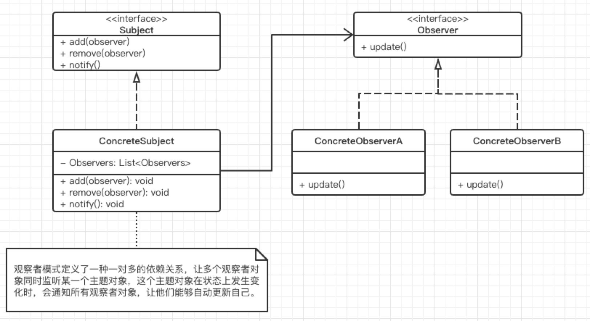
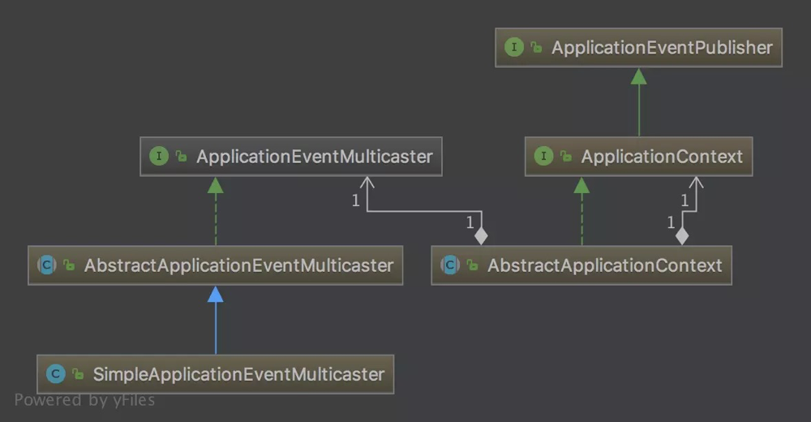
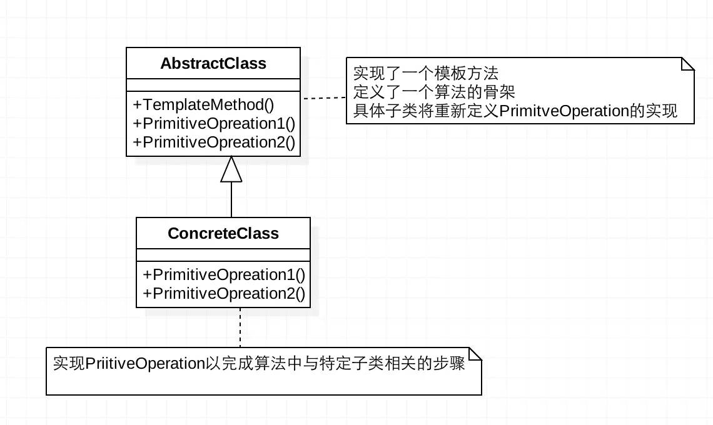

本文是针对spring中涉及到的设计模式记下自己的理解，顺便回顾设计模式的知识点，可能包括sping的部分源码。

#### 工厂设计模式

Spring有**BeanFactory**和**ApplicationContext**两种类型容器，可以通过这两种方式来创建bean对象，其中就是涉及到了工厂模式，工厂模式比较好理解，可以分为三种：简单工厂模式、工厂方法模式和抽象方法模式。

就拿工厂方法模式举例，其实简单工厂模式不在26种设计模式之中，工厂方法模式只是将简单工厂的一个工厂变为多个工厂，多个工厂实现一个共同接口，直接调用指定的工厂方法创建对象即可，抽象方法在此不做介绍。

#### 观察者模式



观察者模式的定义就不在展开，下面主要介绍spring的事件驱动模型。

Spring的事件驱动模型由三部分组成：

- 事件：**ApplicationEvent**，继承自JDK的**EventObject**，所有事件将继承它，并通过source得到事件源。
- 事件发布者：**ApplicationEventPublisher**及**ApplicationEventMulticaster**接口，使用这个接口，我们的Service就拥有了发布事件的能力。
- 事件订阅者：**ApplicationListener**，继承自JDK的**EventListener**，所有监听器将继承它。




**spring的事件流程总结**

定义一个事件: 实现一个继承自 `ApplicationEvent`，并且写相应的构造函数；

定义一个事件监听者：实现 `ApplicationListener` 接口，重写 `onApplicationEvent()` 方法；

使用事件发布者发布消息:  可以通过 `ApplicationEventPublisher` 的 `publishEvent()` 方法发布消息。

要知道对监听器的操作是在`ApplicationEventMulticaster`中定义的，所以实际执行是委托给`ApplicationEventMulticaster`，会在`AbstractApplicationContext`中获取`event`的监听器然后调用`ApplicationEventMulticaster`的方法。

```Java
@FunctionalInterface
public interface ApplicationEventPublisher {
	//通知所有的注册该事件的应用，事件可以是框架事件如RequestHandledEvent或者特定的应用事件。
    default void publishEvent(ApplicationEvent event) {
        this.publishEvent((Object)event);
    }

    void publishEvent(Object var1);
}
```
下面我们具体看一下`ApplicationEventMulticaster`接口中定义的方法。
```Java
public interface ApplicationEventMulticaster {

	//增加监听者
	void addApplicationListener(ApplicationListener<?> listener);
	//...

	//移除监听者
	void removeApplicationListener(ApplicationListener<?> listener);
	//...
	
	//广播特定事件给监听者
	void multicastEvent(ApplicationEvent event, @Nullable ResolvableType eventType);
```

`AbstractApplicationContext`中定义了对监听者的操作维护，如增加和删除，并提供了将特定事件进行广播的方法。`ApplicationContext`自动到本地容器里找一个`ApplicationEventMulticaster`实现，如果没有则会使用默认的`SimpleApplicationEventMulticaster`，其中有个`invokeListener`（注入给定事件给监听器）和`doInvokeListener`（执行监听器）。

#### 代理模式

**Spring AOP 就是基于动态代理的**，如果要代理的对象，实现了某个接口，那么Spring AOP会使用**JDK Proxy**，去创建代理对象，而对于没有实现接口的对象，就无法使用 JDK Proxy 去进行代理了，这时候Spring AOP会使用**Cglib**，当然也可以使用 AspectJ，Spring AOP 已经集成了AspectJ 。

至于代理模式分为静态代理和动态代理，静态代理比较简单，即再创建一个代理类调用目标方法；动态代理则要实现`InovactionHander`接口，实现`invoke`方法，再在调用方法时生成继承`proxy0`又实现接口的对象。

```Java
public static Object newProxyInstance(ClassLoader loader,Class<?>[] interfaces,InvocationHandler h){
     //所有被实现的业务接口
      final Class<?>[] intfs = interfaces.clone();
     //寻找或生成指定的代理类
      Class<?> cl = getProxyClass0(loader, intfs);
      //通过反射类中的Constructor获取其所有构造方法
      final Constructor<?> cons = cl.getConstructor(constructorParams);
      //通过Constructor返回代理类的实例
      return cons.newInstance(new Object[]{h});
}
```

接下来看看生成业务代理类的getProxyClass0（loader，intfs）的实现.

```Java
private static Class<?> getProxyClass0(ClassLoader loader,
                                           Class<?>... interfaces) {
      // proxyClassCache会缓存所有的代理类，如果缓存中有这个业务代理类，则会从缓存中取出，否则从ProxyClassFactory中生成
  		return proxyClassCache.get(loader, interfaces);
}
```

`ProxyClassFactory`是`Proxy`中的内部类，缓存中如果没有这个代理类则会调用`ProxyClassFactory`中的`apply`方法生成。到这里业务代理类就生成了，我们再回到newProxyInstance方法中，它会将InvocationHandler的实例h传入这个业务代理类实例中。

```Java
return cons.newInstance(new Object[]{h});
```

由于业务代理类是以字节码形式存在于内存中，我们想要看到其全貌可以使用`ProxyGenerator`将其保存下来然后反编译查看其源码。

#### 适配器模式

当你不能调用目标方法，而又不能修改这个方法甚至这个目标类，适配器模式起到的帮助就很大。

springAOP中的适配器模式，`advice`方法适配成`MethodInterceptor`接口(方法拦截器)类型的对象。（ProxyFactoryBean源码解析 ）

springMVC中的适配器模式，通过适配器模式我们将所有的`controller`统一交给`HandlerAdapter`处理，免去了写大量的if-else语句对`controller`进行判断，也更利于扩展新的`controller`类型。

#### 模块方法模式



Spring 中 `jdbcTemplate`、`hibernateTemplate` 等以 Template 结尾的对数据库操作的类，它们就使用到了模板模式。一般情况下，我们都是使用继承的方式来实现模板模式，但是 Spring 并没有使用这种方式，而是使用Callback 模式与模板方法模式配合，既达到了代码复用的效果，同时增加了灵活性。

#### 单例模式

在我们的系统中，有一些对象其实我们只需要一个，比如说：线程池、缓存、注册表、日志对象等，使用单例模式可以省略创建对象所花费的时间，同时减轻 GC 压力，缩短 GC 停顿时间。

推荐两种创建方式：双重检查模式（DCL）和静态内部类模式

```Java
public class Singleton {  
    private volatile static Singleton singleton;  //1:volatile修饰
    private Singleton (){}  
    public static Singleton getSingleton() {  
    if (singleton == null) {  //2:减少不要同步，优化性能
        synchronized (Singleton.class) {  // 3：同步，线程安全
        if (singleton == null) {  
            singleton = new Singleton();  //4：创建singleton 对象
        }  
        }  
    }  
    return singleton;  
    }  
}
```

1. 延迟初始化。和懒汉模式一致，只有在初次调用静态方法`getSingleton`，才会初始化`signleton`实例。
2. 性能优化。同步会造成性能下降，在同步前通过判读`singleton`是否初始化，减少不必要的同步开销。
3. 线程安全。同步创建Singleton对象，同时注意到静态变量`singleton`使用`volatile`修饰。

其中使用`volatile`是为了防止重排序，多线程情况下获取到未初始化的对象。

```Java
public class Singleton { 
    private Singleton(){
    }
    public static Singleton getSingleton(){  
        return Inner.instance;  
    }  
    private static class Inner {  
        private static final Singleton instance = new Singleton();  
    }  
} 
```

1. 实现代码简洁。
2. 延迟初始化。调用`getSingleton`才初始化`Singleton`对象。
3. 线程安全。JVM在执行类的初始化阶段，会获得一个可以同步多个线程对同一个类的初始化的锁。

静态内部类的方法只有在外部调用的时候才会初始化。 